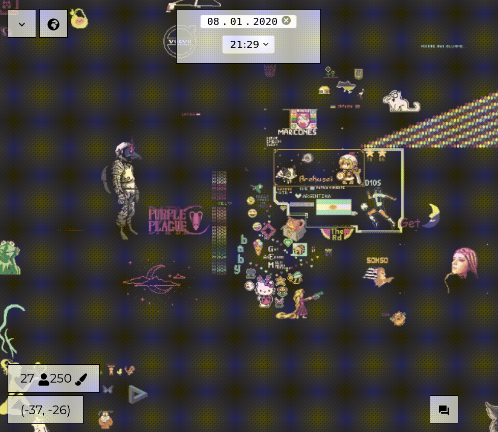
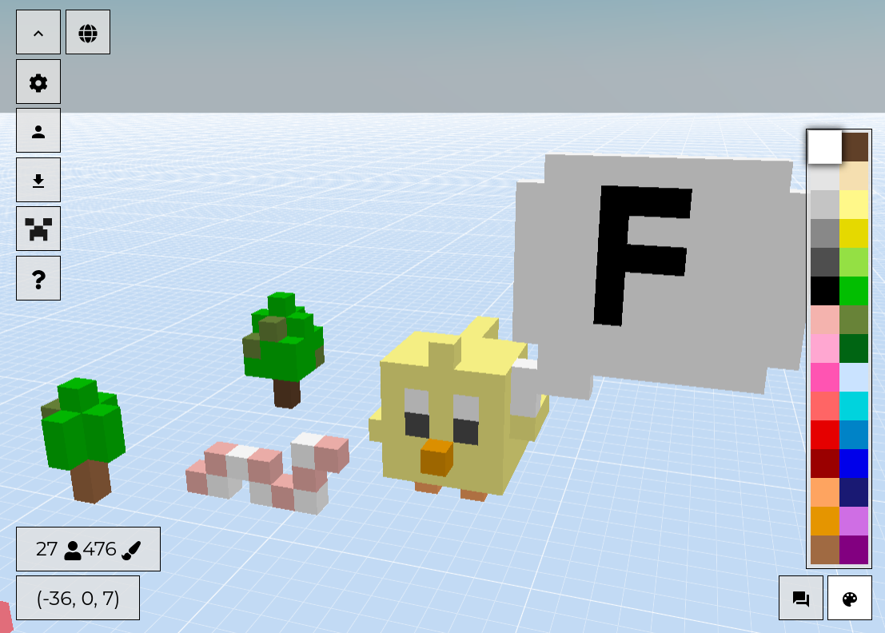

# PixelPlanet


[](https://pixelplanet.fun/guilded)


> Informations on how to contribute translations 🔠 is available under [i18n](./i18n). We very much appreciate any help. 

The future rich, 🩸 bleeding edge, 🕹️ paradigm-changing, 💡 easy to use, blazingly 🔥 fast 🚀🚀🚀 corporative pixel placing game 🔥 in your browser 🌐, built in 100% memory safe nodejs 🦀!
A game changer in the world of browser games ✊🏿

### Controls 🎮

- 🅆, 🄰, 🅂, 🄳, click and drag or pan: Move
- 🅀, 🄴 or scroll or pinch: Zoom
- Click 🖱️ or tap 👆: Place Pixel


## Install and Run

### Requirements 📡

- [nodejs environment](https://nodejs.org/en/) (>=20)
- [redis](https://redis.io/) or [redis-for-windows](https://github.com/redis-windows/redis-windows) in version **6.2.0 or above** as database for storìng the canvas
- mysql or mariadb

Make sure to set-up an own user with password and database for pixelplanet in SQL, i.e. in `mysql` run as `root`:

```
CREATE DATABASE pixelplanet;
CREATE USER 'pixelplanet'@'localhost' IDENTIFIED BY 'sqlpassword';
GRANT ALL PRIVILEGES ON pixelplanet.* TO 'pixelplanet'@'localhost';
```

### Download 📥

Download the current version of pixelplanet from the [Release page](https://git.pixelplanet.fun/ppfun/pixelplanet/releases) (the **pixelplanet-x.x.x.zip** not the Source Code) and unpack the zip file.

### Configuration 🔧

Configuration takes place in the `config.ini` file, or environment variables.
Check out that config file for available options.

Those are options you will most likely want to adjust:

| Variable       | Description              |  Example                |
|----------------|:-------------------------|------------------------:|
| PORT           | Own Port                 | 5000                    |
| HOST           | Own Host                 | "localhost"             |
| REDIS_URL      | URL:PORT of redis server | "redis://localhost:6379"|
| MYSQL_HOST     | MySql Host               | "localhost"             |
| MYSQL_USER     | MySql User               | "pixelplanet"           |
| MYSQL_PW       | MySql Password           | "sqlpassword"           |
| MYSQL_DATABASE | MySql Database           | "pixelplanet"           |

#### Canvas Configuration

Canvas specific configuartion like colors and cooldown is in `canvases.json` for all canvases.
Meaning of some values:

##### Neccessary configuration per canvas

| Key    | Description                                                     |
|--------|:----------------------------------------------------------------|
| ident  | Unique character used in the url                                |
| size   | canvas size, power of 2 and between 256 and 65536               |
| bcd    | Base cooldown for unset pixels                                  |
| cds    | Stack time of Cooldown                                          |

##### Optional configuration per canvas

| Key    | Description                                                     |
|--------|:----------------------------------------------------------------|
| title  | Title of the canvas                                             |
| desc   | Description of the canvas                                       |
| pcd    | Cooldown for placing on set pixels (defaults to same as bcd)    |
| cli    | Number of leading colors on the palette to ignore (default: 0)  |
| req    | requieremt to place on the canvas (default: unset)              |
| ranked | If pixels on canvas count on player statistic (default: false)  |
| v      | If 3D voxel canvas (boolean) (default: false)                   |
| hid    | Hidden canvases, can be just seen by pressing P (default: false)|
| sd     | Start-date of the canvas (for historical view)                  |
| ed     | end date for historical view (canvas retired)                   |
| dcc    | Array of country codes that default to this canvas              |
| linkcd | id of another canvas to take the cooldown from                  |

Notes:

- If `req` is 0, the canvas is only available for registered useers. If it is a number >1 it is the amount of total pixels placed before a player is allowed to play there. If it is `top`, then it is only accessible for the Top10 players of the previous day.
- The colors that are ignored via `cli` are used for making the canvas (blue ocean and white continents) and to know if the pixel is already set by a user or not.
- If you want to add a new canvas, be sure that you additionally create `public/loading${canvasId}.png`, `public/assets3d/normal${canvasId}.jpg`, `public/preview${canvasId}.png` and `public/assets3d/specular${canvasId}.jpg`, check out the existing ones to see what those files are for.

### Preperation 📊

Inside the pixelplanet folder, install the required packages:

```
npm install
```

### Running ‍⚡

1. Make sure that mysql and redis are running
3. Start with

```
npm start
```

Now you can access pixelplanet on `http://localhost:5000` or whatever other *HOST* and *PORT* you chose inside `config.ini`.

### Stopping 🛑

Press Ctrl-C

### What to do next❓

Read [DEPLOYMENT.md](./doc/DEPLOYMENT.md) for tips on how to run it on a server.

## Build from Source

### Requirements 📡
- [nodejs environment](https://nodejs.org/en/) (>=20)

### Building 🤖
Checkout repository

```
git clone https://git.gs-os.com/ppfun/pixelplanet.git
cd pixelplanet
```

Install packages and build

```
npm install
npm run build
```

All needed files to run it got created in `./dist`. You can copy it to wherever you want to run pixelplanet.

## Development

Run `npm run lint:src` to check for code errors and warnings or `npm run lint -- ./your/file.js` to check a single file.

Compile with source-maps and debug options (but only english language) with

```
npm run build:dev
```

[ttag](https://github.com/ttag-org/ttag/) is used for handling translations. For server-side rendering the `Accept-Language` header gets checked and the first locale used and on-the-fly translated (`src/core/ttag.js` provides the functions). On the client-side a seperate bundle for every language gets provided.
The language definitions in `i18n/template.pot` and `i18n/template-ssr.pot` get updated when doing a full production build with all languages (`npm run build`).

To build only specific languages, you can define them with the `--langs` flag (probably won't work on Windows):

```
npm run build -- --langs de,gr
```

### Customization 👑

For customization check out [CUSTOMIZATION.md](./doc/CUSTOMIZATION.md).

## Hourly Event

Hourly event is an MMORPG style event that launches once in two hours where users have to fight against a growing void that starts at a random position at the main canvas. If they complete it successfully, the whole canvas will have half cooldown for a few minutes.

## Backups and Historical View

PixelPlanet includes a backup script that creates full canvas backups daily in the form of PNG tile files and incremential backups all 15min to 20min.

It requires a [second running redis instance](https://www.digitalocean.com/community/questions/multiple-redis-instances-on-ubuntu-16-04).

See the `config.ini` section about Historical View to learn more.

- You do not have to run backups or historical view, it's optional.



## 3D canvas

If v is set and true for a canvas in the canvas.json, it will be a 3D voxel canvas.
3D Canvases can not be seen in Historical View.


